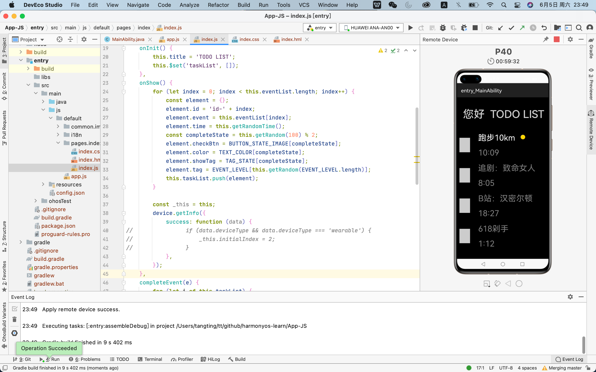

# HarmonyOS 应用开发

官网：https://www.harmonyos.com/cn/develop  

以下开发基于macOS环境  

- [HarmonyOS 应用开发](#harmonyos-应用开发)
  - [1. 开发准备](#1-开发准备)
    - [1.1. 安装 DevEco Studio](#11-安装-deveco-studio)
    - [1.2. 配置开发环境](#12-配置开发环境)

## 1. 开发准备

### 1.1. 安装 DevEco Studio

macOS运行环境要求

- 操作系统：macOS 10.14/10.15/11.2.2
- 内存：8GB及以上
- 硬盘：100GB及以上
- 分辨率：1280*800像素及以上

下载地址：https://developer.harmonyos.com/cn/develop/deveco-studio  

下载完成后，双击下载的“deveco-studio-xxxx.dmg”软件包。  
在安装界面中，将“DevEco-Studio.app”拖拽到“Applications”中，等待安装完成。  

安装完成后，先不要启动DevEco Studio，接下来请根据配置开发环境，检查和配置开发环境

### 1.2. 配置开发环境

1. 通过DevEco Studio向导指引开发者下载HarmonyOS SDK，默认情况下，SDK会下载到user目录下，您也可以指定对应的存储路径，SDK存储路径不支持中文字符，然后点击Next。

2. 默认会下载最新版本的HarmonyOS Java SDK、JS SDK、Previewer和Toolchains。在弹出的License Agreement窗口，点击Accept开始下载SDK。

3. 等待HarmonyOS SDK及工具下载完成，点击Finish，界面会进入到DevEco Studio欢迎页。

SDK默认会下载HarmonyOS Java SDK、JS SDK、Previewer和Toolchains，点击上图欢迎页中的Configure（或图标） > Settings，进入HarmonyOS SDK页面，可以下载其它组件，只需要勾选对应的组件包，然后点击Apply即可。  

未完待续。。。

